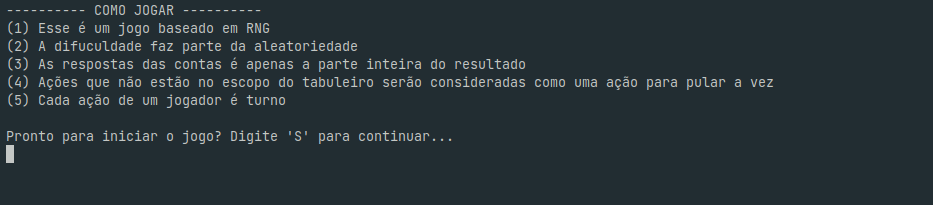
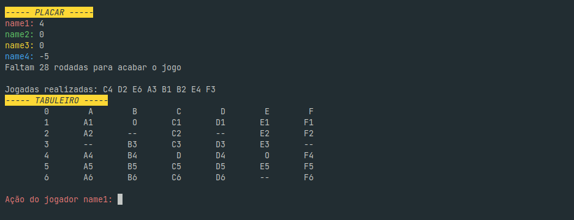

# 💎 Diamonds game

This simple game was created for a college work. \
Here you need to find the diamonds hidden in the mine with a limited number of movements using buffs while avoiding obstacles. But take care, the mine is all based in RNG, so... you will need luck! \
\
The game contains simple events and mini-games.

## ⚙️ See it running





## 👨‍💻 How to install and run

This project was made to run on the terminal

First, you will need to clone my GitHub repository

After that, just compile the C++ project: 

```bash
  g++ main.cpp -o diamonds_game
```

And then run it:
```bash
./diamonds_game
```
    
## 📝 License

This project has the [MIT](https://choosealicense.com/licenses/mit/) license.

